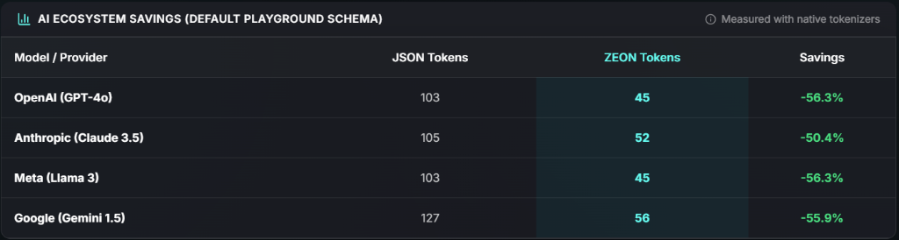

<div align="center">
  
  <h1>ZEON</h1>
  <p><strong>Zero-overhead Encoding Object Notation</strong></p>
  <p>Pare de desperdiçar 40% dos seus tokens de LLM com chaves e aspas do JSON. O ZEON é um formato de dados tabular que reduz drasticamente seus custos de API com OpenAI/Claude.</p>
  <p>
    <a href="https://pypi.org/project/zeon-format/"></a>
    <a href="https://www.npmjs.com/package/zeon-format"></a>
    <a href="https://marketplace.visualstudio.com/items?itemName=FallenBR.zeon-vscode"></a>
    <a href="https://open-vsx.org/extension/FallenBR/zeon-vscode"></a>
    <a href="https://github.com/Fallen-sch/ZEON/actions/workflows/ci.yml"></a>
    
  </p>
</div>

<div align="center">
  <br/>
  <a href="#">
    
  </a>
  <br/>
  <h3><a href="#">Teste o Playground & Calculadora de Tokens ao Vivo</a></h3>
  <br/>
</div>

---

O ZEON é uma linguagem de serialização sensível a espaços em branco que elimina as partes mais caras do JSON em termos de tokens — chaves redundantes, colchetes e vírgulas — através de uma **Gramática Tabular Orientada a Sufixos**. Declare o seu schema uma vez e liste seus dados de forma limpa abaixo dele.

## Índice

- [Por que o ZEON?](#por-que-o-zeon)
- [Guia de Início Rápido](#guia-de-início-rápido)
- [Instalação](#instalação)
- [Guia de Sintaxe](#guia-de-sintaxe)
- [Usando o ZEON com LLMs](#usando-o-zeon-com-llms)
- [Benchmarks de Desempenho](#benchmarks-de-desempenho)
- [Ferramentas para Desenvolvedores](#ferramentas-para-desenvolvedores)
- [Referência da CLI](#referência-da-cli)

---

## Por que o ZEON?

Quando você envia dados estruturados para um LLM, o JSON obriga você a repetir todas as chaves em todas as linhas. Uma lista de 1.000 produtos repete `"id"`, `"name"`, `"price"` — e as aspas, dois pontos e vírgulas ao redor deles — 1.000 vezes cada. Cada um desses caracteres custa tokens.

O ZEON resolve isso com **indentação tabular**: declare o cabeçalho uma vez, liste as linhas abaixo.

**JSON** — 1.100 tokens (~$0.0110 por chamada com GPT-4o):
```json
"products": [
  {"id": "SKU-001", "name": "Wireless Headphones", "category": "electronics", "price": 149.99, "in_stock": true},
  {"id": "SKU-002", "name": "Mechanical Keyboard", "category": "electronics", "price": 89.90, "in_stock": true},
  {"id": "SKU-003", "name": "USB-C Hub", "category": "accessories", "price": 34.50, "in_stock": false},
  {"id": "SKU-004", "name": "Monitor Stand", "category": "accessories", "price": 45.00, "in_stock": true},
  {"id": "SKU-005", "name": "Webcam 4K", "category": "electronics", "price": 119.00, "in_stock": true},
  {"id": "SKU-006", "name": "Desk Lamp", "category": "furniture", "price": 29.99, "in_stock": true},
  {"id": "SKU-007", "name": "Laptop Sleeve", "category": "accessories", "price": 19.90, "in_stock": false},
  {"id": "SKU-008", "name": "Ergonomic Mouse", "category": "electronics", "price": 55.00, "in_stock": true},
  {"id": "SKU-009", "name": "Cable Organizer", "category": "accessories", "price": 12.50, "in_stock": true},
  {"id": "SKU-010", "name": "Portable SSD", "category": "electronics", "price": 79.99, "in_stock": true}
]
```

**ZEON** — 640 tokens (~$0.0064 por chamada com GPT-4o) — **42% menos tokens, mesmos dados:**
```
products[]
  id name category price in_stock
  SKU-001 "Wireless Headphones" electronics 149.99 True
  SKU-002 "Mechanical Keyboard" electronics 89.90 True
  SKU-003 "USB-C Hub" accessories 34.50 False
  SKU-004 "Monitor Stand" accessories 45.00 True
  SKU-005 "Webcam 4K" electronics 119.00 True
  SKU-006 "Desk Lamp" furniture 29.99 True
  SKU-007 "Laptop Sleeve" accessories 19.90 False
  SKU-008 "Ergonomic Mouse" electronics 55.00 True
  SKU-009 "Cable Organizer" accessories 12.50 True
  SKU-010 "Portable SSD" electronics 79.99 True
```

Em escala (1.000 produtos), o ZEON economiza ~46.000 tokens por chamada — cerca de **$0.46 por chamada, ou $460 a cada 1.000 chamadas**.

---

## Guia de Início Rápido

## Instalação

### Python

```bash
pip install zeon-format
```

```python
import zeon

# Ler e serializar
data = zeon.loads(text)
zeon_text = zeon.dumps(data)

# Conversão de strings
json_text  = zeon.convert(zeon_text).to_json()
yaml_text  = zeon.convert(zeon_text).to_yaml()
zeon_text  = zeon.convert(json_text).to_zeon()

# Conversão de arquivos — salvo junto com o original por padrão
zeon.convert("path/to/data.zeon").to_json("data.json")
zeon.convert("path/to/data.json").to_zeon("data.zeon")

# Ou especifique um caminho de saída personalizado
zeon.convert("path/to/data.json").to_zeon("exports/my_data.zeon")
```

### Node.js / TypeScript

```bash
npm install zeon-format
```

```typescript
import { parse } from 'zeon-format';

const result = parse(`
project_name="ZEON"
config
  timeout retries
  30 5
`);

console.log(result.project_name); // ZEON
console.log(result.config.timeout); // 30
```

> Documentação completa do NPM: [parsers/javascript/READMEBR.md](parsers/javascript/READMEBR.md)

---

## Guia de Sintaxe

O ZEON utiliza espaços para separação e literais no estilo Python (`True`, `False`, `None`).

### 1. Pares Chave-Valor Primitivos

Atribuições padrão usam `=`. Datas ISO e identificadores são suportados nativamente sem aspas.

```
order_id=ORD-99321
is_active=True
deleted_at=None
created_at=2026-08-16T14:30:00Z
```

### 2. Objetos Planos

Objetos utilizam indentação. Não requer `{}`.

```
customer
  id name email
  8472 "Maria Silva" maria@example.com
```

### 3. Arrays de Objetos (Formato Tabular)

Utilize o sufixo `[]`. A primeira linha recuada (indentada) é o cabeçalho; todas as linhas subsequentes são as linhas de dados (rows).

```
users[]
  id role
  1 admin
  2 guest
```

**Arrays na Raiz:** Se o seu arquivo/payload inteiro for apenas uma lista de objetos, utilize o marcador `[]` na primeira linha:

```
[]
  id name
  1 Alice
  2 Bob
```

### 4. Sub-Objetos Aninhados (Cabeçalhos em Tupla)

Declare um objeto aninhado no cabeçalho usando `key(sub1 sub2)` e mapeie os valores de forma posicional.

```
products[]
  id dimensions(weight unit)
  1 (1.2 kg)
```

Você também pode anexar pares adicionais de chave-valor (inline) no final de qualquer linha:

```
items[]
  name attributes(damage defense)
  sword (10 10 extra_fire=5)
```

Isso será analisado como `{"damage": 10, "defense": 10, "extra_fire": 5}`.

### 5. Matrizes N-Dimensionais

Utilize `[2]` para matrizes 2D e `[3]` para matrizes 3D (camadas separadas por uma linha em branco).

```
shipping_route[2]
  -23.5505 -46.6333
  -23.5501 -46.6341

cube_data[3]
  1 1
  1 1

  0 0
  0 0
```

### 6. Formato Tabular com Chaves (Dicionário de Objetos)

Utilize o sufixo `{}` para dicionários de objetos uniformes. A primeira coluna se torna a chave principal.

```
environments{}
  region replicas debug
  production eu-central-1 6 False
  staging eu-central-1 2 True
```

Para dicionários contendo arrays primitivos, utilize `{[]}` e pule a linha de cabeçalho:

```
user_roles{[]}
  "admin" 1 2 3
  "guest" 4 5
```

### 7. Formato Híbrido Tabular-Inline (Dados Semi-Uniformes)

Para arrays nos quais as linhas compartilham algumas chaves (mas não todas), o ZEON utiliza as chaves comuns como o cabeçalho e anexa as propriedades adicionais na forma "inline" ao final de cada linha.

```
event_logs[]
  timestamp level message
  2026-08-17T10:00:00Z INFO "User logged in" user_id=405
  2026-08-17T10:01:00Z ERROR "DB Timeout" retry_count=3 context=(db=users)
```

### 8. Objetos e Arrays Multi-linhas em formato Inline

`(...)` para objetos, `[...]` para arrays. Indentações e quebras de linha dentro deles são ignoradas.

```
config=(
  db_pool=(
    host=localhost
    port=5432
    options=(
      ssl=True
      timeout=30
    )
  )
  nodes=[
    192.168.0.1
    192.168.0.2
  ]
)
```

### 9. Fallback para Dados Mistos

Para arrays irregulares sem nenhum esquema comum, o ZEON utiliza notação inline:

```
mixed_data=[1 "hello" (flag=True) [2 3]]
```

`[]` para arrays, `()` para objetos inline — sem vírgulas, sem aspas onde for desnecessário.

### 10. Anotações Visuais (Ignoradas pelo Parser)

Adicione anotações do tipo `[label]` aos cabeçalhos das colunas para legibilidade humana. O parser as ignora completamente.

```
users[]
  id[Number] name preferences(theme) aliases[]
  1 Maria (light) [mary mah]
```

---

## Usando o ZEON com LLMs

Inclua um breve bloco de referência no seu **System Prompt** para que o modelo saiba como gerar a saída no formato ZEON.

> **Esse bloco de referência consome minha economia de tokens?**
> O bloco abaixo custa ~120 tokens — um gasto fixo, cobrado apenas uma vez e que se paga rapidamente após as primeiras 4–5 linhas de dados. Qualquer resposta com mais de 10 linhas já representa lucro. Quanto mais linhas o seu JSON tiver, maior o ganho.

```text
Return all structured data strictly in ZEON format.
ZEON uses tabular indentation: declare a header once, list data below it.
Suffixes: [] = array of objects, {} = keyed dict, () = inline object, [2]/[3] = matrices.
No JSON braces, no commas, no repeated keys.

<reference.zeon>
project_name="ZEON Demo"
is_active=True

# Flat objects use indentation
config
  timeout retries
  30 5

# Tabular arrays: first indented line is the header
users[]
  id name preferences(theme)
  1 "Alice" (dark)
  2 "Bob" (light)

# Extra dynamic attributes go inline at the end of the row
logs[]
  level message
  INFO "System started" timestamp=2026-08-18T10:00:00Z
  ERROR "DB Failed" retry=True
</reference.zeon>
```

Esse simples exemplo é suficiente para que GPT-4, Claude e Gemini consigam gerar dados em formato ZEON válido independentemente do formato dos seus dados.

> **Dica Pro:** Para esquemas muito complexos, primeiramente converta um dos seus arquivos JSON para ZEON através da nossa CLI: `zeon convert data.json --print`. Copie o que sair na tela e use diretamente no seu prompt!

---

## Benchmarks de Desempenho



> **Teste você mesmo!** Confira o [Notebook de Benchmark de Tokens](examples/token_savings_benchmark.ipynb) interativo para ver a economia de tokens em dados reais sendo calculada ao vivo com a biblioteca `tiktoken` da OpenAI.

Avaliado em 8 formatos reais de dados usando o tokenizer `cl100k_base` (GPT-4 / tiktoken):

| Dataset | Elegível para Tabular | JSON Compact | YAML | **ZEON** | vs JSON | vs YAML |
| :--- | :---: | ---: | ---: | ---: | ---: | ---: |
| Funcionários (100 linhas, flat) | 100% | 2.804 | 3.702 | **1.709** | `-39.1%` | `-53.8%` |
| Repositórios GitHub (30 linhas, flat) | 100% | 2.083 | 2.461 | **1.188** | `-43.0%` | `-51.7%` |
| Analytics Séries Temporais (60 linhas, flat) | 100% | 2.332 | 2.870 | **1.498** | `-35.8%` | `-47.8%` |
| Contatos (50 linhas, flat) | 100% | 2.603 | 3.302 | **1.716** | `-34.1%` | `-48.0%` |
| Pedidos E-commerce (50 linhas, aninhado) | 33% | 4.933 | 6.220 | **3.581** | `-27.4%` | `-42.4%` |
| Feature Flags (40 chaves, keyed map) | 100% | 825 | 963 | **487** | `-41.0%` | `-49.4%` |
| Logs de Eventos (75 linhas) | 50% | 2.944 | 3.617 | **2.303** | `-21.8%` | `-36.3%` |
| Configurações Aninhadas Profundamente | 0% | 137 | 173 | **105** | `-23.4%` | `-39.3%` |
| **TOTAL** | — | **18.661** | **23.308** | **12.587** | **`-32.5%`** | **`-46.0%`** |

Em dados 100% tabulares, o ZEON atinge ganhos de até **-43%** contra JSON minificado e **-53%** contra YAML. Até mesmo no pior cenário possível de configurações profundamente aninhadas, o ZEON nunca gasta mais tokens que o JSON.

---

## Ferramentas para Desenvolvedores

A **Extensão Oficial do VS Code** fornece a experiência completa para edições de arquivos `.zeon`:

- **Realce de Sintaxe (Syntax Highlighting)** — Cores para as tabelas, matrizes, valores primitivos e objetos em linha.
- **Linter em Tempo Real** — Captura erros de sintaxe e uso incorreto de sufixos na hora em que você digita.
- **Preview Visual Interativo (Live Preview)** — Renderiza o arquivo como uma tabela visual à direita. Edite os valores pela tabela visual e pressione `Ctrl+S` para aplicar tudo de volta ao arquivo!

Instale pela [VS Code Marketplace](https://marketplace.visualstudio.com/items?itemName=FallenBR.zeon-vscode) ou [Open VSX](https://open-vsx.org/extension/FallenBR/zeon-vscode).

---

## Referência da CLI

Converta arquivos de ZEON, JSON, e YAML diretamente no seu terminal:

```bash
# JSON / YAML -> ZEON
zeon convert data.json -> data.zeon
zeon convert config.yaml -> config.zeon

# ZEON -> JSON / YAML
zeon convert data.zeon -> data.json
zeon convert data.zeon -> data.yaml

# Visualizar diretamente pelo terminal
zeon convert data.json --print
```

---

*ZEON — Menos tokens. Mesmos dados. Menores custos.*
