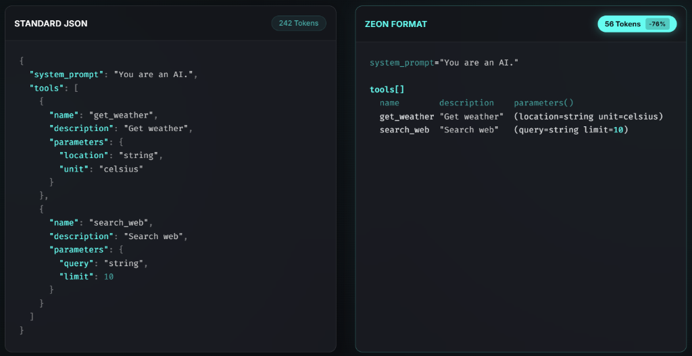

  
  <h1>ZEON Format</h1>
  

    
    
    
    
    
  

Official VSCode extension for the [ZEON](https://github.com/Fallen-sch/ZEON) data format.

**ZEON** is an ultra-lightweight, tabular data format engineered specifically for AI token economy. By eliminating the heavy syntax and nested brackets found in JSON, it provides LLMs with highly structured grid data using the absolute minimum number of tokens possible. This drastically reduces prompt costs and speeds up generation while remaining clean and readable.

## JSON vs ZEON (Token Economy)

ZEON can reduce your LLM payload token usage by up to **76%** compared to standard JSON, while keeping the data perfectly structured for AI consumption.

## Features

This extension provides an essential toolkit for anyone working with `.zeon` files in VS Code:

### Intelligent Syntax Highlighting
Say goodbye to plain text! Our TextMate grammar natively understands the structure of ZEON files:
- Differentiates tabular headers from grid data.
- Highlights strings, numbers, booleans (`True`/`False`), and null values (`None`).
- Intelligent scope mapping ensures compatibility with almost any VS Code theme.

### Interactive Visual Preview
Why look at raw text when you can edit your tables visually?
Click the **ZEON: Open Preview** button in the top right corner of any open `.zeon` file to instantly generate an interactive, beautifully styled grid.

* **Live Rendering:** Transforms raw text columns into a clean CSS Grid layout.
* **Inline Editing:** Edit the cells directly inside the preview table! Changes are synchronized instantly back to your `.zeon` source file.
* **Smart Saving:** Press `Ctrl+S` inside the table to apply all pending edits and save the file atomically. No more switching back and forth!
* **Dotted Guidelines:** Sleek horizontal visual guides help your eyes track wide rows effortlessly.

### Safety Built-in
- **Race Condition Prevention:** A custom message queue guarantees your edits are processed in exact order, preventing conflicts between immediate saves and edits.
- **Smart Focus:** The extension knows exactly which document the preview is tied to, allowing you to open multiple previews securely.

## Usage

1. Open any file with the `.zeon` extension.
2. Observe the instant syntax highlighting.
3. Click the **Open Preview** button on the editor title bar, or right-click the file in the Explorer and select `ZEON: Open Preview`.
4. Edit your data visually!

---
*Developed by Schicksal for the ZEON Ecosystem.*
